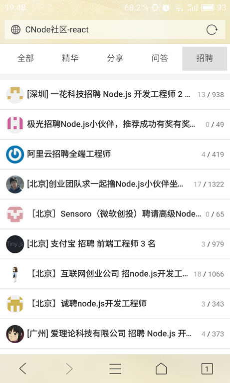
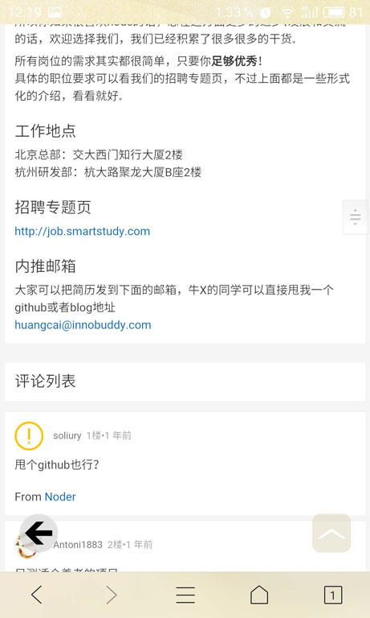

# CNode社区网页客户端 —— React版

### 使用方法

* 首先确保你已经全局安装`Node.js`、`webpack`、`webpack-dev-server`

* 如果你连接了WiFi，需前往 `app/components/TopicDetail.js` 以及 `app/components/TopicList.js` 里将hostname设置为你本地的内网IP地址。这样你可以使用连接同一个WiFi的手机来访问你本机的地址，在手机上浏览访问。

* 如果你没有打算通过局域网共享，那么你还是将`app/components/TopicDetail.js` 以及 `app/components/TopicList.js` 修改为'localhost'，这样也能访问。

* 打开客户端

``` sh
$ cd app
$ npm i
$ npm run build
$ npm run start
```

* 打开爬虫服务器

``` sh
$ cd server
$ npm i
$ node app.js
```

* 打开网页[http://localhost:5001](http://localhost:5001)

### 网页截图

首页：



帖子详情页1：


帖子详情页2：



评论列表：

